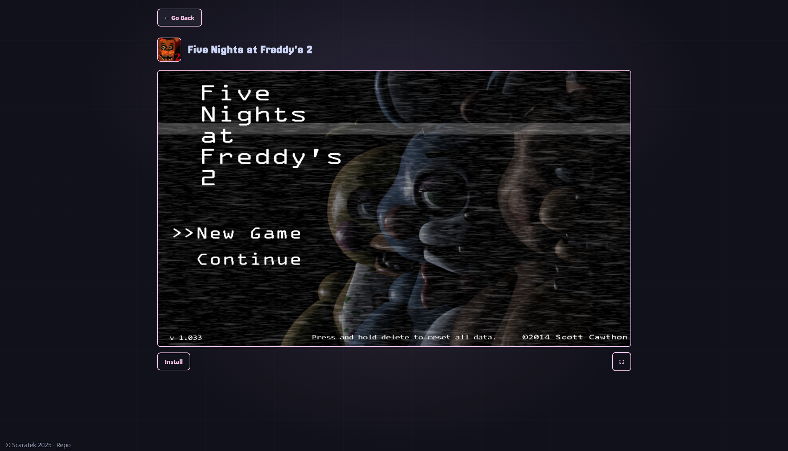

# Vapor
The unblocked games website for the rest of us
>[!WARNING]
> Currently Vapor does **not** have a public demo, nor are the games themselves. This is so I don't get DMCAd!

## What Exactly is Vapor?
Vapor is a games website focused on providing a high quality experience and high quality games. What makes Vapor different is its offline support, you can download games to the browers built-in storage (OPFS) and play all the games available fully offline (sometimes this can even work to bypass web-filters). Vapor also provides a high quality selection of games, mainly WASM ports, not the regular slop you would find on other game websites. 

 |  |
| --- | --- |

## Setup
Requirements:
- A UNIX-like shell
- NodeJS
- PNPM (`npm i -g pnpm`)
- Git

### Clone the Repo
```sh
$ git clone https://github.com/scaratech/vapor
$ cd vapor
```
### Install Dependencies
```sh
$ pnpm i
$ mkdir build
```
### Add Games
>[!IMPORTANT]
>Each game should have its directory as the game ID and the games icon should be `game_id.png`
>Also, the directory is named `core` instead of `game` to help with automatic filter detection
```sh
$ mkdir core
```
Then place all of your games in that directory like this:
```sh
hazel@nightcord:~/ama2$ ls core/
fnaf1  fnaf2  fnaf3  fnaf4  fnaf5  fnaf6  fnaf7
```
Each directory should have an `index.html` file, like this:
```sh
hazel@nightcord:~/ama2$ ls core/fnaf1
index.html  resources  src
```
Then, in `public/images/` you should have a icon for each image, like this:
```sh
hazel@nightcord:~/ama2$ ls public/images/
fnaf1.png  fnaf2.png  fnaf3.png  fnaf4.png  fnaf5.png  fnaf6.png  fnaf7.png
```
Once you've added these, now you need to register the games in the `metadata.json` file:
```sh
$ node scripts/update.js --id="game_id" --name="Game Name"
```
Then, you need to "map" the game assets
```sh
$ node scripts/mapper.js
```
Finally, copy over `core/` to `build/`:
```sh
$ cp -r core/ build/
```
### Building
```sh
$ pnpm build
```

### Starting
```sh
$ pnpm serve
# Or, start the dev server:
$ pnpm dev
```
